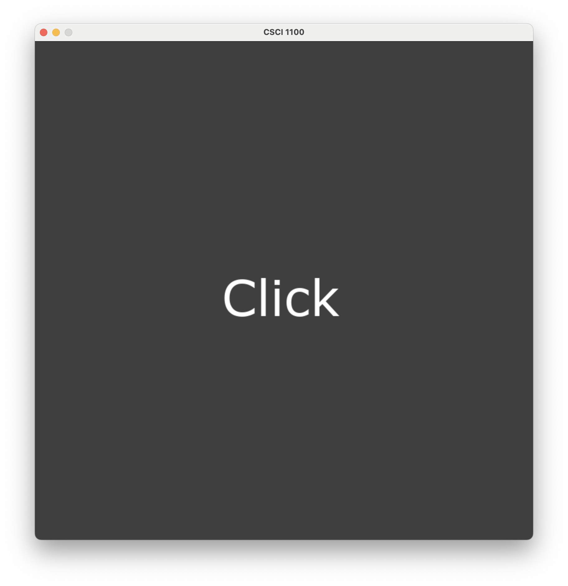

# CSCI 1100 Gateway to Computer Science

## Fall 2022

Robert Muller - Boston College

---

## Lecture Notes
## Week 6

**Topics:**

1. Monday & Tuesday: Learning from the touchSquares App
1. Wednesday & Thursday: Problem Set 3 Workshops


---

### 1. Learning from the touchSquares App

The touchSquares app is very simple. It is started from the command line as in

```bash
python3 bestTouch.py 3
```

where the command-line input `3` indicates the number of rows and columns managed by the app. The app then starts in a `Ready` state with a splash screen inviting a click. When the user clicks, the application transitions from the `Ready` state to a `Running` state.

|  |  |
| :--------------------------: | :-------------------------: |
|         Splash Image         |   After Click & 4 Touches   |

In the running state, the application is listening for touchpad events. If the touchpad is released with the cursor arrow pointing in row R and column C, then a randomly colored square is placed at that row and column.

##### Using Python Enumerations to Introduce Meaningful Symbolic Names

The `bestTouch.py` code illustrates a good way to represent the *state* of the application: either `Ready` or `Running`. We can use Python's `enum` feature to represent the state as in

```python
class State(Enum):
  Ready   = 0
  Running = 1
```

Then we can refer to the state with meaningful symbolic names `State.Ready` and `State.Running`. 

##### Using Python classes to Introduce Meaningful Symbolic Names for Composite Values

What is changing during the course of running our app? In the touchSquares example, the *state* changes from `State.Ready` to `State.Running` when the user clicks, the *image* changes as the user adds colored squares and the size of the grid `n` is required in order to create a colored square of the right size. So the overall state of our application has 3 parts: `state`, `image` and `n`. In the model-view-update system that we're using, these 3 parts must be bundled up into a single value, called a *model*.

It's natural to think of using a simple 3-tuple `(state, image, n)` as a representation of the model. This can be made to work but it doesn't provide the reader of the code much support in remembering what's what. It would be better to have meaningful symbolic names, so that if `mod` was a model, then `mod.state` would refer to the `state` portion of the model, `mod.image` would refer to the `image` portion and `mod.n` would refer to the grid size.

The `bestTouch.py` code illustrates a good way to represent the multi-part model using a Python class. The class form is often used for other purposes but it can be put to use just to support the use of symbolic names described above.

```python
class Model():
  def __init__(self, state, image, n):
    self.state = state
    self.image = image
    self.n     = n
```

Given the above definition of the `Model` class, the name of the class `Model` can be "called" as though it were a function as in `Model(State.Ready, Image.empty(10, 10, Color.white), 4)`. (Behind the scenes, the class `__init__` function is called on our behalf in order to create and initialize a class value.) If we capture the created model in a variable, say, `mod` as in

```python
mod = Model(State.Ready, Image.empty(10, 10, Color.white), 4)
```

We can then refer to the 3 parts of the model using the chosen symbolic names together with the dot notation.

````python
... mod.state ... mod.image ... mod.n ...
````

The whole code is here.

```python
# CSCI 1100 Gateway to Computer Science
#
# This program displays an NxN grid of randomly colored squares.
# Click to place a square.
#
# run: python3 bestTouch.py N

from animate import *
from enum import Enum
import sys

# Splash page
backing = Image.rectangle(WIDTH, HEIGHT, Color.DarkGray)
instruction = Image.text("Click", Color.White, 80)
_x, _y = HEIGHT // 2 - 100, WIDTH // 2 - 40
splash = Image.placeImage(instruction, (_x, _y), backing)

# The program is either ready or running. Clicking changes the
# state from ready to running. This version is an improvement over
# betterTouch.py in that it uses an enumeration rather than global
# constants.
#
class State(Enum):
    Ready   = 0
    Running = 1

# toggle : state -> state
def toggle(state):
    if state == State.Ready:
        return State.Running
    else:
        return State.Ready

# Define a record type with model.n, model.image and model.state
#
class Model():
    def __init__(self, n, image, state):
        self.n = n
        self.image = image
        self.state = state

# view : model -> image
def view(model):
    return model.image
        
# touchUpdate : model * (int * int) * event -> model
def touchUpdate(model, xy, event):
    if event == Touch.Down:
        return model
    # event is Touch.Up
    if model.state == State.Ready:
        newState = toggle(model.state)
        return Model(model.n, backing, newState)
    # event is Touch.Up and model.state is State.Running
    side = WIDTH // model.n
    square = Image.rectangle(side, side, Color.random())
    (arrowX, arrowY) = xy
    (col, row) = (arrowX // side, arrowY // side)
    (x, y) = (col * side, row * side)
    image = Image.placeImage(square, (x, y), model.image)
    return Model(model.n, image, model.state)

# finished : model -> boolean
def finished(model):
    return False

# go : unit -> unit
def go():
    n = 0
    if len(sys.argv) == 2:
        n = int(sys.argv[1])
    else:
        print("run: python3 bestTouch.py N")
        sys.exit()

    initialModel = Model(n, splash, State.Ready)

    Animate.start(model=initialModel,
                  view=view,                 # model -> image
                  touchUpdate=touchUpdate,   # model * xy * event -> model
                  stopWhen=finished)         # model -> boolean

go()
```

### 2. Problem Set 3 Workshops

This time was used for working on Problem Set 3: The Best Candidate Algorithm.
